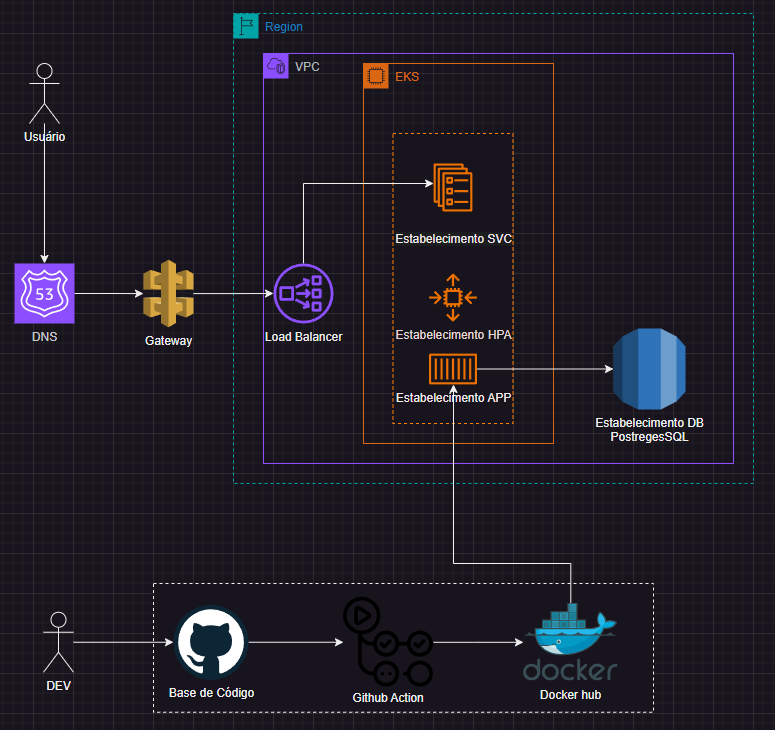
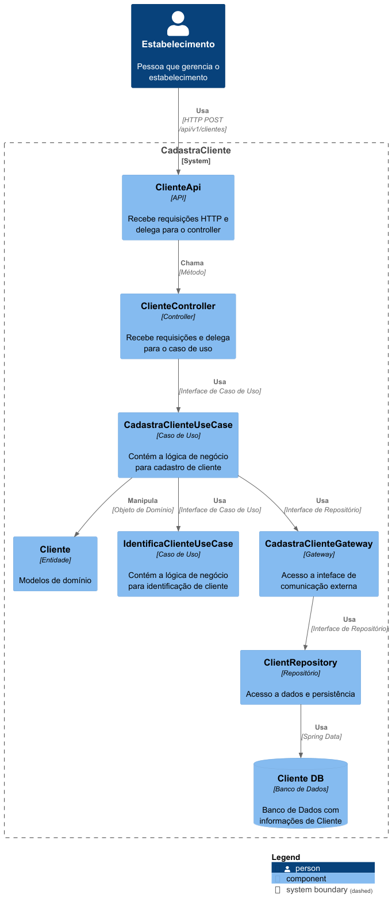
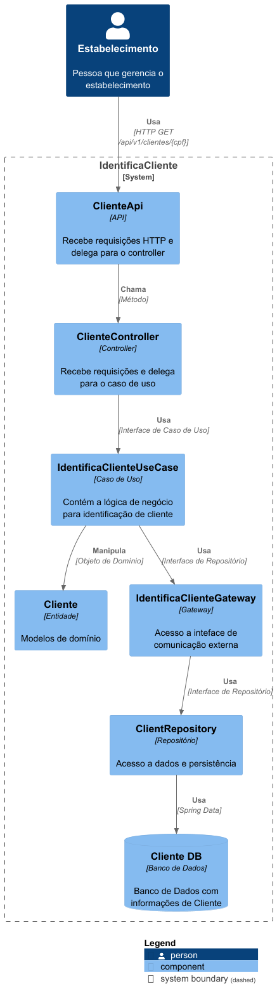
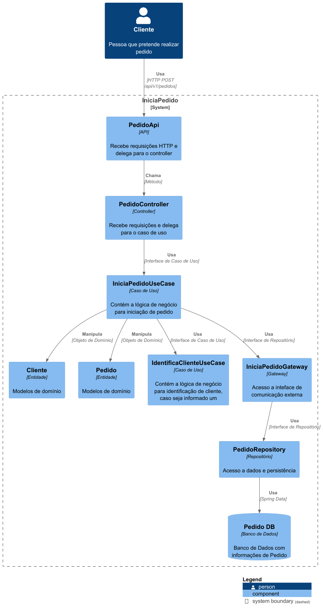
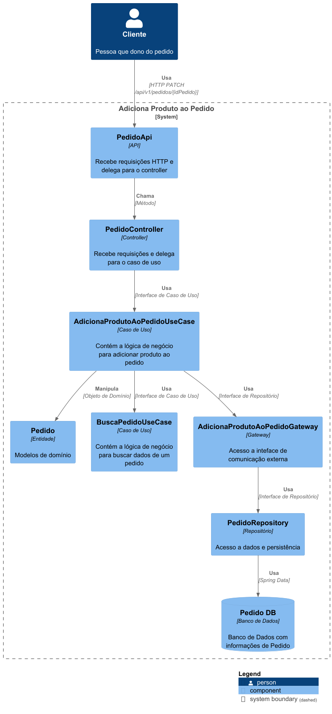
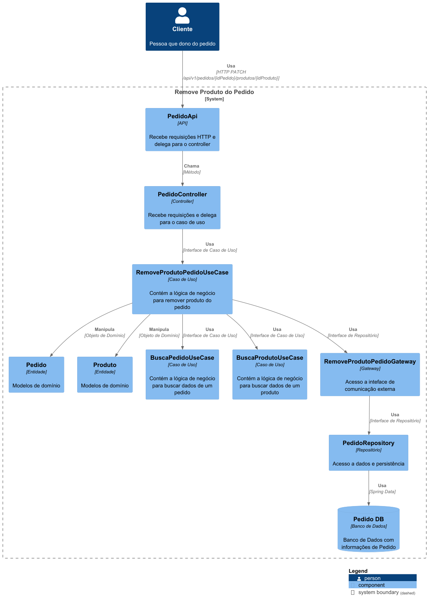
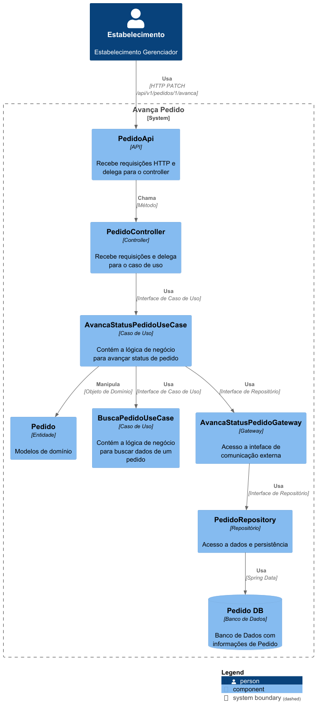
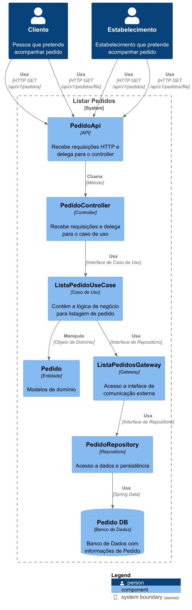
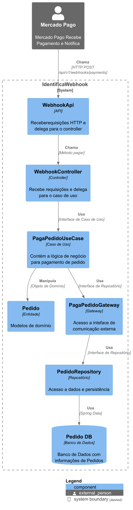

# Tech Challenge - Estabelecimento

# Índice

* [Breve Descrição](#Breve-Descrição)
* [Tecnologias Utilizadas](#Tecnologias-Utilizadas)
* [Índice](#índice)
* [Desenho Solução](#Desenho-Solução)
* [Estrutura do Projeto](#Estrutura-do-Projeto)
* [Rodando o Projeto Local](#Rodando-o-Projeto-Local)
* [Endpoints](#Endpoints)

## Breve Descrição

Aplicação se trata de um Projeto Fiap Tech Challenge - Software Architecture, simulando um projeto de um estabelecimento
de pedidos (fast-food), nesta primeira fase a arquitetura da aplicação consiste em usar Hexagonal.

## Tecnologias Utilizadas

- Java
- Spring
- Swagger
- Postgres
- Docker
- Docker Compose
- AWS
- Kubernetes

## Desenho Solução

### Infra AWS



### Componentes

- Cliente
    - Cadastra Cliente </br>
      
    - Identifica Cliente </br>
      

- Produtos
    - Cadastra Produto </br>
      
    - Editar Produto </br>
      
    - Remover Produto </br>
      
    - Busca Produto </br>
      
    - Busca Todos os Produto e por Tipos </br>
      

- Pedidos
    - Inicia Pedido </br>
      
    - Adiciona Produto ao Pedido </br>
      
    - Remove Produto Pedido </br>
      
    - Avança Pedido </br>
      
    - Lista Pedidos e Lista Pedidos na Fila </br>
      

- Webhooks
    - Pagamentos </br>
      

## Estrutura do Projeto

- Entrypoint: Entrada de acesso externo para a aplicação
    - Api: Entrada de acesso via Rest a aplicação
    - Controller: Controlador da lógica dos UseCases do que chega na aplicação.
    - Presenter: Camada que faz algumas transformações de dados para serem apresentadas.
- Core: Sem acesso ao mundo externo, livre de frameworks e isolado.
    - Domain: Pode ser acesso por qualquer um.
    - Usecase: Regras de negócio
    - Dataprovider: Interfaces para o dados do mundo externo
- Dataprovider: Implmentações para o mundo externo
    - Gateway: Implementações das Interfaces de acesso do Core.
    - Repository: Database
- Config: Configurações do Projeto

## Rodando o Projeto Local

### 1. Pré-requisitos

Certifique-se de ter as seguintes ferramentas instaladas:

- Docker
- Git
- JDK 21 ou superior

### 2. Clonar o Repositório

Clone o repositório do projeto:

```sh
git clone https://github.com/leodelmiro/tech-challenge-estabelecimento
```

### 3. Executar o Script de Setup

O projeto inclui um script de setup (`setup.sh`) que automatiza o processo de construção e execução do projeto. O script
realiza as seguintes operações:

- Para e remove os contêineres Docker, juntamente com seus volumes.
- Executa a construção do projeto Maven.
- Inicia os contêineres Docker em modo destacável e reconstrói as imagens se necessário.

Para executar o script, siga os passos abaixo:

#### macOS e Linux

1. **Tornar o Script Executável**:

    ```sh
    chmod +x setup.sh
    ```

2. **Executar o Script**:

    ```sh
    ./setup.sh
    ```

#### Windows

1. **Executar o Script**:

   No PowerShell ou Git Bash:

    ```sh
    ./setup.sh
    ```

## Executar Local com Kubernetes

1. **Criar RDS** </br>
   Dentro de Infra/aws existe alguns scripts que são necessários para subir aplicação já que ela faz uso de RDS. É
   necessário um SG para acesso externo e um RDS que chame ele. </br>

2. **Criar EKS** </br>
   Dentro de Infra/aws existe alguns scripts que são necessários para criar um cluster EKS. É necessário também um
   NodeGroup. </br>

3. **Mudando o contexto do kubectl**
    ```sh
    aws eks update-kubeconfig --region us-east-1 --name my-cluster
    ```
4. **Rodando kubectl**
    ```sh
    cd infra && kubectl apply -f kubernetes.yml
    ```

## Endpoints

Os Endpoints da aplicação, podem ser acessados pelo Swagger ao rodar o projeto na
url http://localhost:8080/swagger-ui/index.html

**Caso preferir pode importar a collection Insomnia que se encontra no projeto, no arquivo Insomnia Collection, porém
será
necessário o Insomnia instalado.**